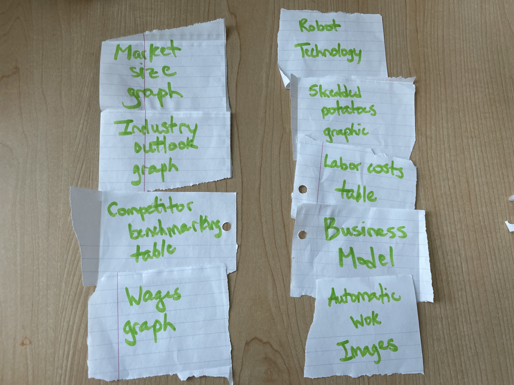
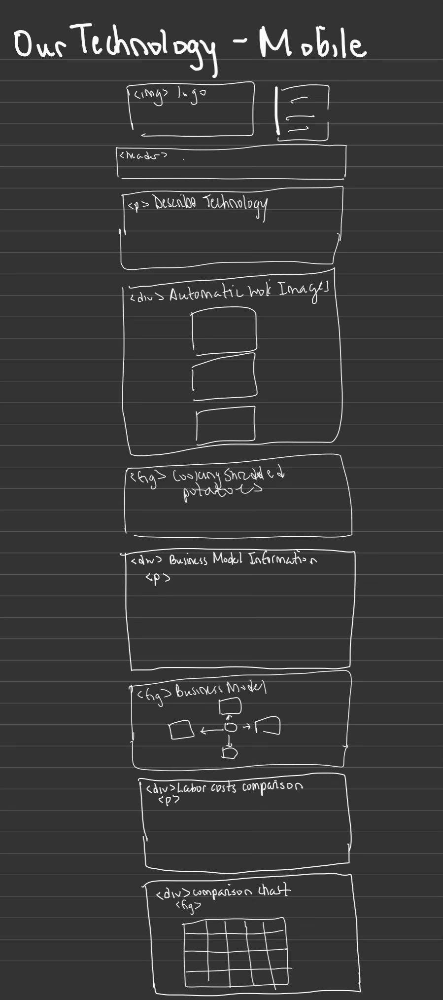
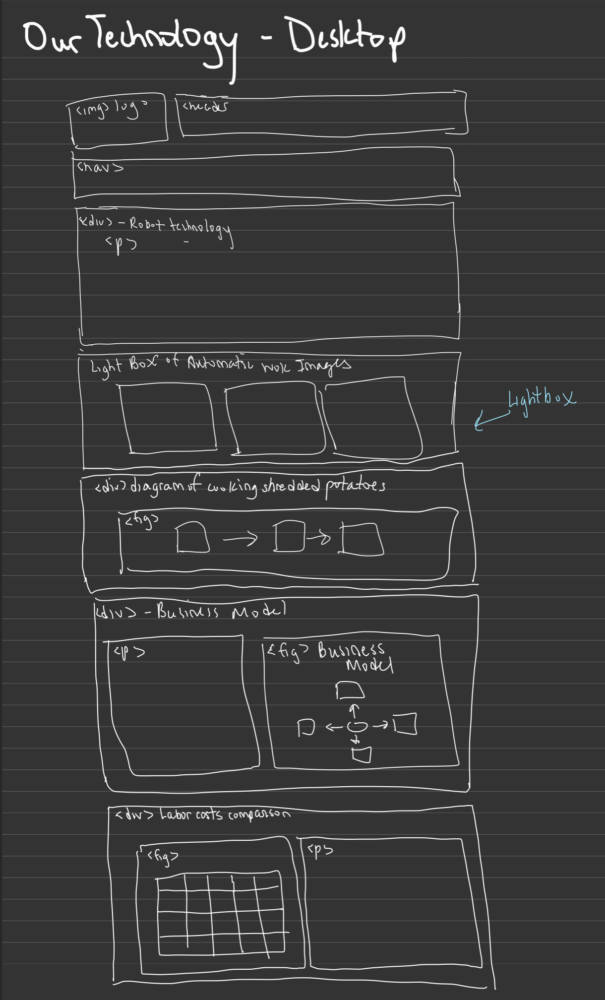

# Group Project: Design Journey

**You are encouraged to work ahead on everything on this project.** (Though we suggest you hold back on the interactivity until Project 3.) **Each section is required for a specific milestone. You are required to have these sections completed before that milestone's deadline.**

**Be clear and concise in your writing.** Bullets points are encouraged.

**Everything, including images, must be visible in Markdown Preview.** If it's not visible in Markdown Preview, then we won't grade it. We won't give you partial credit either. This is your warning.


# Client (Milestone 1)

## Client Questionnaire (Milestone 1)

1. Describe your organization and its purpose.

Purpose: designing different robots to help prepare Chinese cuisine

Chinese food is very difficult and time consuming. The labor cost is increasing after the pandemic and Chinese restaurants depend on Chinese chefs. However, because of the immigration policy, Chinese chefs cannot work. MiFoodTech plans to solve this problem by designing robots to cook Chinese food.

The team includes hotelies, ECE, and CS students for marketing and robotics purposes. The plan is for the ECE and CS students to develop the software and hardware. There will be a talking machine, along with the cooking machines. The software will be able to facilitate management and can connect the robots to work automatically.

An example of a dish that will the robots will be able to make is fried shredded potato with green pepper. The idea is that a chef will no longer be needed, but the restaurant may need prepping staff. The use of robots will save lots of money.

The team is looking into the market size, customer acquisition strategy, and competition benchmark. In the future, we will work on prototype validation, R&D, and market expansion.

2. What makes your organization and its services special or unique?

The organization is special because the use of robots will replace the need of chefs and reduce labor costs. Looking at the competition, other companies have not yet developed fully automatic robots, which MiFoodTech is aiming towards.

3. Why are you looking for a new website or updating your existing site?

MiFoodTech currently does not have a website. We would like a website introduce the problems and solutions to them, introduce the team, show the technology, and future steps.

4. Who do you want to visit your site? Who is your site's target audience?

We would like investors to visit the site. Our site's target audience is investors.

5. When visiting your site, what actions do you want your visitors to take?

MiFoodTech wants visitors to see their mission and technology, and hopes that  will want to become part of the founding team. We hope that user will invest in our company to help fund our progress.

6. What are your goals for this site?

Our goals for the site are to present information about our project that will attract investors.

7. Is there a "feel" that you want for your site? Are there colors or imagery that you have in mind?

We want a very simple, neat and clean website. We want brightly colored images on a simplistic website. Additionally, we want a big image on the homepage.

8. What are your three favorite competitors or similar organizations' sites? Why?

**Junzi**
https://www.junzi.kitchen/
Junzi is another chinese restaurant that already has 5 restaurants. We like this site because of how simple and clean it looks. There is a big image at the top that really displays the food.

**Canary Technologies**
https://www.canarytechnologies.com/
Canary technologies is a hotel company, and restaurant is a similar industry. We also like how simplistic the website is. Specifically, we like how the website includes problems and solutions, client testimonials, and other related companies on the homepage.

**Doordash**
https://www.doordash.com/
Doordash is a really popular company. The website also has a really large image at the top of the homepage. The website is simplistic and has bright images that are appealing and eye-catching.

9. How often would you like to meet or receive updates?

We would like to meet once a week.

9a. If yes would you prefer email, zoom, or other?

If you have any questions, we can talk over Slack. We do not have any preferences.

10. Are you going to provide content (images, etc.)for your site?

We don't have many images right now. You can search online and find images. The design of the website is most important, and we can change the images once we have more images. You can use images and text from the slides presentation on your website and contact me if you need more information.

11. Do you have any potential user interviewees you would like us to reach out to?

Not at the moment.


## Client Description (Milestone 1)

Our client is Mi Yan, a grad student who is hoping to launch his FoodTech startup soon. He is hoping to create and sell robotic kitchen assistants, specifically for Chinese restaurants. Our client meets the client rules in the project requirements because they are external. They are not one of our group, no team member in the group is a member of this organization, and none of us have a personal relationship with our client.


## Client Website (Milestone 1)

Our client wants a website that they can show to future potential investors and demonstrates their product well. They are hoping that, through the contents presented on the website, they will be able to not only show who they are as a team, but also what they hope to achieve in their future, as well as provide details about their projects. Accordingly, the website will be about the team's background and purpose, the members, and ongoing projects; the website will also be designed in order to convince potential investors to join their mission


## Client Website Scope (Milestone 1)

We plan on making 5 pages for the client as they suggested in the meeting. This will not be too big as we have 5 team members so each one of us can take ownership of one page. We also want to make sure to include everything that the client mentioned in the meeting as making sure that they get the website they need should be our first priority. Additionally, we want the website to portray what our client thinks investors should know in a way that is not too cluttered (meaning there is not too much on each page) and there is a lot of material in the slides that can be organized into about 5 pages.


## Client Goals (Milestone 1)
> What kind of website do they want? What are their goals for the site?
> There is no required number of goals. You need as many goals as necessary to reflect your client's desires.

- Goal A: A polished website that compares favorably with competitors such as Junzi.
- Goal B: Present information about restaurant that will attract investors.
- Goal C: Very simple, neat and clean website. Include brightly colored images on a simplistic website. Big image on the homepage.
- Goal D: Website that showcases MiTechFood team, shows the technology, and future steps.


## First Client Meeting Minutes/Notes (Milestone 1)
**Introduction**
- master's students in department of natural resources in CALS
- wants to open up restaurant

**MiFoodTech General Info**
- mi food tech
- designing differnet robots to help   - prepare chinese quizine
- chinese cuisine more complex than other cuisines
- stir and fry

**Slide Presentation**
Present slide:
- prepare food
- chinese food time consuming
- labor coast increasing, after pandemic
- chinese restaurant depends on chef
- chinese chefs from china cannot work because of immigration policy ==> lack of chinese chefs
- solve problem by robots
- students in ECE, CS with experience in robotics working in team
- big picture: software and hardware
    - talking machine + cooking machine
    - software can facilitate management and connect everything to work automatically
- fried shredded potato with green pepper
    - chef will not be needed anymore
    - maybe prepping staff
    - save lots of money
- market size
- customer acquisition strategy
- Competition benchmark
    - other competition not fully automatic
- team has hotelies
- milestones for future
    - prototype validation, R&D, Market Expansion
- submit presentation

**Other Notes**
- we introduce ourselves
- we have 5 ppl =  5 pages

- what are u more interested in for website? (technology or consumer side)

**Example websites**
- Junzi: https://www.junzi.kitchen/
- Canary Technologies:https://www.canarytechnologies.com/
    - homepage shows the problem on the homepage
    - covid want to reduce human to human problem
    - challenges in industry and show how we can provide solution to industry
    - testimonial from customes
    - application of technology to other companies
    - hotel is simalar to restaurant
- Doordash: https://www.doordash.com/

**Theme/Aesthetic**
- simple and neat and clean aesthetic
- colorful and bright

**Webpage ideas**
- homepage
- with big picture
- prototypes
- page about technology.. currently working on
- going to have a new restaurant in ithaca
    - have a menu
-introduct team
- next stems
- cornellians who are interested can invest ==> page about investment

**Possible pages**
1. homepage
    - opportunities/problems
    - what makes you different and important
    - not lots of text on homepage
2. team  
3. menu
4. technology
5. investment

**Goals for Audience**
- most important thing: after they visit website, the feel interested in idea and become investors
- for investors (target audience)

**Images?**
- not many images
- sample images... where to put what kind of information
- prototype images

**Communication**
slack:
- prefer to continue over zoom?
- slack or email
- how often do you want to meet?
    - meet once a week
- send emails with questions

**User Interviews**
- any users to reach out to?
- talk about it at a later date
- interview team members
 - one team memeber is a chef
 - another worked at michelin star restaurant
 - reach out to people in industry

**How to get more content**
- google labor costs in restuarants
- you'll see lots of reports
- rephrase sentences from
- let know if need more text
- use prototype images for technology page

# Plan/Schedule (Milestone 1)
> Make a plan of when you will complete all parts of this assignment.
> This plan is for your team. There is no required format. Format it so that it works for you!


Recruit user interviewees: 10/27 - 11/2
Write user interview questions: 10/29
Conduct user interviews: ASAP before the 5th
Synthesize user interviews and write goals: Team Meeting ASAP
Plan content: Team Meeting ASAP (Same one)
Content organization / card sorting: After lab 11/5
Design and plan interactivity + sketches: After lab 11/12
Client feedback mtg: TBD, Between 12th and 13th, 14th if neccesary
Draft website: On your own time, ASAP after feedback meeting, done by 11/16

Recruit user testing people: 11/17-11/19
User testing: Done by the 22nd
Changes based on user testing: Finish on your own time
Deliver website: done by 12/1


# Site Design/Plan (Milestone 2)

**Make the case for your decisions using concepts from class, as well as other design principles, theories, examples, and cases from outside of class.**

You can use bullet points and lists, or full paragraphs, or a combo, whichever is appropriate. The writing should be solid draft quality but doesn't have to be fancy.

## Understanding Users (Milestone 2)

### Audience (Milestone 2)
> Briefly explain your site's audience. Be specific and justify why this audience is a cohesive group with regard to your client's site. This audience should not be overly broad nor arbitrarily specific. It should be a cohesive group with similar _goals_.

Our site's audience is potential investors in MiFoodTech. This is a cohesive group as any investors would want to know where their money is going and how it is being used. Therefore, the information they would be trying to find is similar across the board and can be organized in a  way to target MiFoodTech's website towards this audience.

### User Interview Questions (Milestone 2)
> Plan the user interview which you'll use to identify the goals of your site's audience.

**User Interview Briefing & Consent:** Hi, I am a student at Cornell University. I'm currently taking a class on web design and for a project I am designing a web site for Mi Yang of MiFoodTech. MiFoodTech is a startup that uses robots to help Chinese restaurants reduce labor costs and improve food quality. I'm trying to learn more about the people that might use this site. May I ask you a few questions? It will take about 10-15 minutes. You are free to quit at any time.

1. Have you ever invested before? Have you ever invested in a restaurant?
    - Have you ever invested in a restaurant like MiTechFood?
    - If yes, what did you invest in most recently and why?
    - If not, ...
2. Did you seek out any information before deciding to invest?  If yes, what was that information? How did you obtain it?
    - What is the most important piece of information that influenced your decision to invest?
    - How did you feel about the {business, company, startup, etc} you decided to invest in?
3. Is there any information you wish you had known about your investment beforehand or information you weren’t able to find?
4. (Optional) Does the idea of investing in MiTechFood appeal to you? Why or why not?
5. What is an important piece of information that you always want to know before investing in a company, brand or restaurant?
6. When investing, is learning about your investees background important? Why or why not?
7. (Optional) How long or how well do you have to know an individual or startup like MiTechFood before you would feel comfortable investing in them?
8. Do you have any considerations or reservations, if any, about investing in MiTechFood? Why or why not?
9. What haven’t I asked you today that you think would be valuable for me to know?

**After the interview:** This was really helpful. Thank you so much for agreeing to speak with me today. Have a great day!


### Interview Notes (Milestone 2)
> Interview at least 4 people from your audience. Take notes and include those notes here. Make sure to include a brief description of each interviewee.

**Interviewee 1:**

Roopanshi Ramapal is a sophomore at Cornell University. She is studying Applied Economics and Management and is a member of the Cornell Venture Capital Club. She is a member of our intended audience as MiFoodTech would like us to make a website that they can show investors and she analyzes companies for her business club to invest in and learn about regularly and has knowledge of business concepts that we would need to feature on our website to attract investors.

1. Have you ever invested before? Have you ever invested in a restaurant?
    - Have you ever invested in a restaurant like MiTechFood?
    - If yes, what did you invest in most recently and why?
    - If not, ...
No- she has not personally invested before. However, she is explaining through the lens of someone who often looks at companies for her club as an analyst.


2. Did you seek out any information before deciding to invest?  If yes, what was that information? How did you obtain it?
    - What is the most important piece of information that influenced your decision to invest?
    - How did you feel about the {business, company, startup, etc} you decided to invest in?

She has not invested yet, but she says that when she is looking at companies, she would seek out market trends and how the industry is doing pre and post covid. She wants to know if a product is something that a market would even need (saturation?) and if a product is something that people would be open to implementing. She alsos say that she would want to see a lot more information about competitors and logistics of the product.


3. Is there any information you wish you had known about your investment beforehand or information you weren’t able to find?

She says that she finds it hard to find quantitative information about smaller companies, especially ones that are in a more niche industry like food tech.


5. What is an important piece of information that you always want to know before investing in a company, brand or restaurant?

Interviewee one says that when she is analyzing a company, she always wants to know about incumbents and how realistic it is for this small company to make a space and a name for themselves.

She mentions the Fintech industry: Paypal is the incumbent and they have literally 48% of the market share. She would only be looking at small startups that have a wild differentiating factor becuase brand and reputation, which incumbents already have is super valuable.


6. When investing, is learning about your investees background important? Why or why not?

Yes 100%. She wants to make sure that the investee is reputable and their past work has been successful. Especially for startups that she looks at (ie Seed and Series A), she does not know what profitability margins are and so she has to gain trust. She wants to see as many past transactions as possible.

7. (Optional) How long or how well do you have to know an individual or startup like MiTechFood before you would feel comfortable investing in them?

She would need to understand the business model completely and know each member of the team, not just the person running it. She also says that she needs to see a game plan and where her money would be going for the next few years.


8. Do you have any considerations or reservations, if any, about investing in MiFoodTech? Why or why not?

She thinks that she personally does not know as much about the foodtech industry as she would like to and wants to know more about how MiFoodTech fits in.


9. What haven’t I asked you today that you think would be valuable for me to know?

She re-emphasizes the differentiating factor. She wants to see an in depth analysis of how a company tackles an issue in the industry in comparison to other startups and incumbents.


**Interviewee 2:**
Iris Li, junior studying Computer Science, is a member of Cornell Cup Robotics. She works in system engineering. She is working on a lab assisted robot (like R2D2). She is a member of our intended audience because she works in teams to create effective robots. She has knowledge of MiTechFoods technology and why it may appeal to consumers and investors.

1. Have you ever invested in a restaurant or invested in general?
No, no investment and not a restaurant but have used Doordash frequently.

2. Did you seek out any information before deciding to invest?  If yes, what was that information? How did you obtain it?
  Iris hasn't invested but if she did she would look to see how well the company is performing and ensure that she will make money. She would want information about the market to see if it is worth investing her own money.

3. Is there any information you wish you had known about your investment beforehand or information you weren’t able to find?
Some companies aren't transparent and something as unique as a robot tech food restaurant may not have certain details ironed out, especially if it is their first startup or test restaurant. It may be hard to find industry or market information since it is so specific.

4. Does the idea of investing in MiTechFood appeal to you? Why or why not?
Yes appeals. Seems about the same. It doesn't appeal because of the novelty. She's been to a robot chef restaurant but it was underwhelming. She went with the robotics team in high school but was not significantly different from other restaurants. Called Spyce in Boston.

5. What is an important piece of information that you always want to know before investing in a company, brand or restaurant?
Models how they get people to buy food and how they are profitable over the long term. Maybe good because of its consistent quality. People may not have job opportunities. May be nice to slowly transition but places aren’t ready for that right now, people might not be upset. If she hadn't gone to a similar type of restaurant before she said it is a very specific area so most people may find it difficult to find this information easily on the web.

6. When investing, is learning about your founders background important? Why or why not?
Yes she cares, very important. As a startup you aren’t going to have that many people so leadership should be good and have expertise in both technical in marketing and finance.

7. How long or how well do you have to know an individual or startup like MiTechFood before you would feel comfortable investing in them?
It depends on how much money she would invest. If it is a lot she would want to have a lot of familiarity and contact them frequently. She would like to have say and give her input, otherwise if she is a regular investor, if they had a stock or republic offering she wouldn’t need to know them personally.

8. Do you have any considerations or reservations, if any, about investing in MiTechFood? Why or why not?
No jobs for people in the community.

9. What haven’t I asked you today that you think would be valuable for me to know?
She is excited to see MiTechFood when they come to Ithaca and hopes people in the community will be receptive since Ithaca is a small collegetown.


**Interviewee 3:**

Interviewee 3 is a senior at Cornell studying Computer Science and is a member of Cornell AppDev, Cornell Chinese Students Association, and Women in Computing at Cornell. She has experience investing and is knowledgeable about the finance field.

1. Have you ever invested before? Have you ever invested in a restaurant?
  - Have you ever invested in a restaurant like MiTechFood?
  - If yes, what did you invest in most recently and why?
  * yes - robinhood for investing, roth ira (that is managed by her dad)
  * no restaurants before
2. Did you seek out any information before deciding to invest?  If yes, what was that information? How did you obtain it?
- listens to podcast snacksdaily , talking to parents about it who have experience with investing, low stakes investing with robinhood, keeping up with news
- What is the most important piece of information that influenced your decision to invest?
  - internship at fidelity two summers ago, talked ab money + finance + investing, how important compounding investing was
- How did you feel about the {business, company, startup, etc} you decided to invest in?
  - big, well known, companies so pretty guaranteed to get returns ; not a personal connection
3. Is there any information you wish you had known about your investment beforehand or information you weren’t able to find?
 - a lot that companies don’t tell you, high barriers to entry ie technical jargon, companies’ performance
4. (Optional) Does the idea of investing in MiTechFood appeal to you? Why or why not?
5. What is an important piece of information that you always want to know before investing in a company, brand or restaurant?
 - looks at past performance, with different time scales
 - not going to spend hours before researching a restaurant
6. When investing, is learning about your investees background important? Why or why not?
 - yes, to some extent if you have time; could align on personal values and estimated returns ; looking at what they working on , more potential in future for newer companies
7. (Optional) How long or how well do you have to know an individual or startup like MiTechFood before you would feel comfortable investing in them?
8. Do you have any considerations or reservations, if any, about investing in MiFoodTech? Why or why not?
  - would want to talk to ppl behind it, see why they are doing it, “Story behind company is really interesting”, how they plan on achieving their goals, what they are doing does influence , product roadmap, how they want to scale it, if it’s viable or not
9. What haven’t I asked you today that you think would be valuable for me to know?
- NA


**Interviewee 4:**

Jason Ng is a sophomore at Cornell University in Dyson. He is part of Cornell's Grub Venture. He is part of our intended audience because he is a potential investor with knowledge of investing in general, as well as investing in the food industry. Grub Ventures specifically focuses on impacting the food and agriculture industry. They also partner with food, technology, and agriculture focused venture-capital firms. This works well since our audience is potential investors in MiFoodTech, which is a food+robotics startup company.

1. Have you ever invested before? Have you ever invested in a restaurant?

Yes

- looking to invest into cryptocurrency mining (specifically Bitcoin or Script mining). Miners are called ASIC miners, specialized computers used only for mining
    - feel like cryptocurrency is in a rise, many companies using cryptocurrency as a form of transaction (eg. Tesla), also very passive, you set it up and don’t have to worry about it anymore.
- been investing into index funds. Index funds are a stock that owns multiple shares of other companies. (eg. S&P 500). the safest way to increase your ROI(return on investment). For example, if one company tanks and goes bankrupt, there’s still 499 other companies.

- never invested in a restaurant before
- I have invested into a restaurant chain stock known as Yum China - company that owns brands such as KFC, Pizza Hut, and Taco Bell in China.
- the stock has so far been declining a bit due to covid in China.

1a. Have you ever invested in a restaurant like MiTechFood?
N/A
1b. If yes, what did you invest in most recently and why?
N/A

2. Did you seek out any information before deciding to invest?  If yes, what was that information? How did you obtain it?

Yes

- for crypto mining, did a lot of research via youtube or asking one of my friends who does GPU mining
- used youtube to find ways to optimize mining through specific outlets that need to be configured at my “house”, as well as the most optimal/efficient miners available in 2021.
- beforehand i didn’t know about index funds. i just started investing around 2 years ago. i watched youtube videos from this guy named Graham Stephen. he emphasized the pros and cons of index funds vs owning stock in one company.
- i want to invest in a safe and passive way==> index funds are safest way for me because i didn’t want to actively manage my stock portfolio

2a. What is the most important piece of information that influenced your decision to invest?

- Time Value of Money ==> i realized that the idea of TVM and compound growth plays a huge part when investing young vs older
- investing money at 18 vs 40, amount much greater earlier than at later time
- at young age, don't have same risk as parents,  important to risk as much as possible when i don’t have anything to lose

2b.  How did you feel about the {business, company, startup, etc} you decided to invest in?

- i felt that there could be a potential for growth and it was a worth wild investment for the future even if it ended up not working.
- eg. my investment into bitcoin miners since there is still a possibility that it could crash tomorrow. i was willing to risk the initial investment to buy the hardware needed. I felt that there was a safe place to simply store my money without fear of it being consumed by inflation.

3. Is there any information you wish you had known about your investment beforehand or information you weren’t able to find?

- for both investments ==> i wish i would’ve entered the market earlier. bitcoin prices have skyrocketed to around 61,000 and just 2 years ago, it was only 8000. stocks prices, QQQ 2 years ago was worth 200 while now it is at 400.

4. (Optional) Does the idea of investing in MiTechFood appeal to you? Why or why not?

- MiTechFood does sound like an appealing investment for me. robots could be applied to the whole restaurant industry and not just Chinese food
- With the high demand in restaurant food and low supply of workers in the workforce, I believe that the next step to combating the rise of unemployment from the pandemic is robot workers for the restaurant industry. also solves the issue regarding sanitation issues within the industry from COVID-19.

5. What is an important piece of information that you always want to know before investing in a company, brand or restaurant?

- important information that I look at before investing into a company:
- their overall growth in the past 5 years
- financial statements to analyze if they are in debt or profit
- their future ventures that they are attempting to make.
==> it allows me to throughly see if they would utilize my investment for the growth of the company.

6. When investing, is learning about your investees background important? Why or why not?

- For the most part yes, I can have a full scope of what I am getting into.
- eg. with current markets of cryptocurrency regarding the shiba coin, most investees are children trading off of their parents accounts therefore ==> would categories that type of investment a high risk and most likely a lost for me.  

7. (Optional) How long or how well do you have to know an individual or startup like MiTechFood before you would feel comfortable investing in them?

- it would mostly likely require a lot of research and analysis before investing into it.
- plan everything out for around 3 months before pulling the trigger.
- eg. when I learned about crypto mining, it took me time to research the current industry, miners, and future profitability if the market plummets tomorrow.

8. Do you have any considerations or reservations, if any, about investing in MiTechFood? Why or why not?

- Some considerations I have about investing in MiTechFood is the possibility that it can’t grow outside of the Chinese food industry
- if it can’t then their potential growth for the future will decline ==> I think that if it can grow into the fast food industry...it would be a high return investment if the robots can accomplish jobs more efficiently than workers.

9. What haven’t I asked you today that you think would be valuable for me to know?

- with stocks, fair warning that there could be a crash soon due to how the economy is shaped from high inflation and a rise in real estate, stocks, and gas prices

**Interviewee 5:**

Oliver Chung is a junior student attending DigiPen Institute of Technology, pursuing a Bachelor of Arts in game design. He falls under our target audience, because one of his general interests and hobbies include investments and stocks. He was also involved with cryptocurrency at some point in the past.

1. Have you ever invested before? Have you ever invested in a restaurant?
    - Have you ever invested in a restaurant like MiTechFood?
    - If yes, what did you invest in most recently and why?
    - If not, ...

Have invested in the past, but not in a restaurant. The most recent investment was for Apple and Amazon because they seemed "reliable" bets compared to other candidates, also had the suggestion of a friend.

2. Did you seek out any information before deciding to invest?  If yes, what was that information? How did you obtain it?
    - What is the most important piece of information that influenced your decision to invest?
    - How did you feel about the {business, company, startup, etc} you decided to invest in?

Did seek out information before investing, the information was obtained through observing and organizing various stock prices. The most important piece of information was another suggestion from his dad. At the time of the investment, he felt satisfied with his choices because they were safe choices and seemed to promise profit from their past prices.

3. Is there any information you wish you had known about your investment beforehand or information you weren’t able to find?

One information that he wish he had known about more is the concept of hedge funds, knowing and being aware of more details would have helped and possibly changed his initial decisions about investments, no particular information that he wanted to find but could not at the time

4. (Optional) Does the idea of investing in MiTechFood appeal to you? Why or why not?

While robotics have shown general development, he is not particularly appealed with the idea of investing in MiTechFood, because he knowns and has personal experience with investments in restaurants being comparably more volatile and therefore unstable, but idea of MiTechFood itself is appealing nonetheless.

5. What is an important piece of information that you always want to know before investing in a company, brand or restaurant?

The past activities and price values of the companies are the most crucial information that he prioritizes before making investments, because while making entirely accurate predictions is difficult he can somewhat deduce whether or not the investment will be profitable by looking at past trends, the more detailed the spanned out the information, the better

6. When investing, is learning about your investees background important? Why or why not?

Definitely important, because investees are part of the company you'd be investing for and they will in one way or the other affect the furture trends of the company itself, especially if they're a representative or a director

7. (Optional) How long or how well do you have to know an individual or startup like MiTechFood before you would feel comfortable investing in them?

For restaurants, you'd need at least about five years to know that they are doing well before you can start looking into actually investing for the company like MiTechFood

8. Do you have any considerations or reservations, if any, about investing in MiTechFood? Why or why not?

No for reasons already mentioned, because restaurant investments tend to be more volatile and riskier than an electronics company, for example

9. What haven’t I asked you today that you think would be valuable for me to know?

N/a

### Goals (Milestone 2)
> Analyze your audience's goals from your notes above. List each goal below. There is no specific number of goals required for this, but you need enough to do the job (Hint: It's more than 1 and probably more than 2).

Goal 1: differentiate MiFoodTech
- **Design Ideas and Choices** _How will you meet those goals in your design?_
  - Have either a page or an infographic/table dedicated to comparison between MiFoodTech and other similar companies
  - This image should be the primary content of the page for ease of reading purposes and because this is such an important thing for most users
- **Rationale & Additional Notes** _Justify your decisions; additional notes._
  - Many of the user interviewees noted that if they were putting their money somewhere, they would want to know what makes this company unique and therefore likely to suceed. Interviewee 1 specifically said that she would need the company to be wildly different from any incumbents as that would signify the possibility of capturing a niche to her.

Goal 2: understand the market/industry
- **Design Ideas and Choices** _How will you meet those goals in your design?_  
  - Have a page dedicated to "what is foodtech?" that we can include the content from Mi's slides on so that users can get good background on the industry
  - This can also introduce incumbents that MiFoodTech is seeking to disrupt
- **Rationale & Additional Notes** _Justify your decisions; additional notes._
  - Interviewees 1 and 3 were specific in saying that they wanted to know more about the market and the industry before they invested in it.
- User interviewee 4 also talked about how he watched lots of youtube videos about crypto currency before deciding to invest in it

Goal 3: interpret stats and numbers
- **Design Ideas and Choices** _How will you meet those goals in your design?_  
  - make sure to put numbers in large text and separate bullet points when giving background information
  - have a section dedicated to specifically these numbers on a page, possible background page, but this should be its own section
- **Rationale & Additional Notes** _Justify your decisions; add notes._
  - many people who had invested before in public companies said that they looked at financial statements and stock prices
  - User interviewee 4 specifically mentioned past prices being important information to him when investing
  - While this information is not public for a small startup like MiFoodTech, any quantitative data they have available seems to be valuable to potential investors

Goal 4: learn about who works at MiFoodTech
- **Design Ideas and Choices** _How will you meet those goals in your design?_  
  - Include team member headshots and bios in a page dedicated to learning about the team behind MiFoodTech
- **Rationale & Additional Notes** _Justify your decisions; add notes._
  - Interviewees 1,2,3,and 5 mention how they want to understand the team members’ backgrounds as it would make them more confident and comfortable in deciding to invest in a startup

Goal 5: learn about the product and business plan
- **Design Ideas and Choices** _How will you meet those goals in your design?_
  - Include images of the product itself and graphics that illustrate the viability of the product with concrete examples
- **Rationale & Additional Notes** _Justify your decisions; add notes._
  - Interviewees 1, 2, 3, 4, and 5 all mentioned that they would need to see exactly what the product is and where the company plans on going with the product
  - They want to know where exactly their money would be going not just now but also in the future
  - Images would be helpful as it is difficult to visualize without them

Goal 6: learn about company history
- **Design Ideas and Choices** _How will you meet those goals in your design?_
  - Include a compelling personal story about the company’s background and how the founder and team got involved in the project
- **Rationale & Additional Notes** _Justify your decisions; add notes._
  - Interviewee 4 and 1 both mentioned that they would want to know about past history to judge future success
  - Many Interviewees wanted to know a bit more personal backstory as this would help them see the company in a different perspective.


## Content Planning (Milestone 2)

**Plan your site's content.**

### Your Site's Planned Content (Milestone 2)
> List the content you plan to include your personal website. This should be a comprehensive list.

- Company Background
- Problems (covid-19, employment, etc)
- Solution (their product)
- Team member bios
- Robot Technology (description of wok robot)
- Customer acquisition strategy
- Future plans and milestones
- Customer acquisition strategy
Images:
- Market size graph
- Industry outlook graph
- Automatic wok image
- Milestones graphic
- Appealing images of chinese food
- Headshots of team members
- Wages as a share of revenue graph
- Cooking shredded potatoes graphic
- Competitor benchmarking table
- Labor costs table


### Content Justification (Milestone 2)
> Explain (about a paragraph) why this content is the right content for your site's audience and how its addressed their goals..

Our content is appropriate and addresses user goals. It the user needs by demonstrating to the intended audience how unique MiTechFoods is as a Chinese restaurant that employs robot technology. This is a revolutionary method in food service and is not only more sanitary, especially in COVID-19 times, but also more efficient. To get this across to users the site includes many images and descriptions of the robot technology and how it is beneficial to consumers. Content about how this niche area of interest is competitive against its competitors and why it will succeed in the long run is detailed through graphs and more infographics and text. These images, graphs and text descriptions all point to the novelty and value of MiTechFood and will effectively appeal to investors looking to make money.
Additionally, a textual background on this restaurant industry will be provided to give investors and better idea of the market/industry. Founder and team member backgrounds will also be provided to give investors confidence about the team’s abilities, experience, and knowledge in this industry setting. It will demonstrate to investors how MiTechFood has the potential to disrupt the industry and will thrive, creating incentive for investors to put  resources toward growing this startup. It also gives them a better sense of the people behind the business and what motivates them to pursue their goals.

Furthermore, stats and numbers on how MiTech Food compares to its competitors will also be provided in large text in bullet points. This draws investor attention to the numbers and will show them how promising MiTechFood is and their projection in the long run. It again drives how unique this company is and what they have to offer to the restaurant industry.

The content addresses learning about who works at MiFoodTech because we included content that has the team members, their information, images of each team member, and the company history. We are including company background, team member bios, and team member bios. This will allow investors to get familiar more with the company  and help them understand the team at MiFoodTech.

Our content will also address learning about the product and business plan because we include information about their plan, as well as many images, graphics, and tables on MiFoodTech’s plan. We include a description of the robot technology that the company is working on. For example, there is a description of the wok robot. We are including an image of the automatic wok, as well as a diagram of how a robot would cook shredded potatoes. This information will help investors learn about the product the MiFoodTech is developing and how it will work. The content includes the customer acquisition strategy, future plans and milestones, milestones graphic, industry outlook graph, and labor costs table. These pieces of information will help investors learn about the business plan and provide the information that will help them decide if they want to invest in the company.

The content will address the goal of learning about company history because we include MiFoodTech’s information on Chinese businesses in the U.S. and why the company started, and its purpose. The information we include is the company background, problems, solutions, and a graphic of wages. This will help investors to understand the motivation of the company, and their overall purpose, which is a huge part of the company history.


## Information Architecture (Milestone 2)

### Content Organization (Milestone 2)
> Document your iterations of card sorting here.
> Include photographic evidence of each iteration of card sorting and description of your thought process for each iteration.

1. First Iteration of Cardsorting


We grouped content into 5 categories: background, about the team, about the robot/technology, the industry, and future plans. The wages graph is part of the background since it can illustrate the context of MiFoodTech's solution. The industry outlook section includes the competitor benchmark and customer acquisition strategy since many of our user interviewees were interested in understanding the market and viability of the startup before investing. The future plans include labor costs because that content could show the effectiveness of MiFoodTech's product by demonstrating the estimated benefits of implementing MiFoodTech in a restaurant.

2. Second Iteration of Cardsorting

-sorted into 5 distinct sections: about the company, team background, industry advantages, robot technology, and future plans
-the sorting is logical and help create distinct focuses for each web page
-pages will have an appropriate amount of content which features images and graphs provided by MiTechFood to best illustrate what their startup can offer

3. Third Iteration of Cardsorting

The five categories from the second iteration are maintained, except the specific contents of robot technology, problems and solutions, and automatic wok image are swapped between their previous categories. As such, we also maintain the same extent of distributing the information across the pages; the only change that have occurred is swapping the scope of the company background page and the robot/technology webpage. What this achieves is a bit more narrow and specific presentation of content from the company background, and a wider and general portrayal of content for the technology webpage.

*New Changes to Cardsort (from re-design process)*

Originally, the business model/plan content was a part of robot technology, but we took Mi's request to separate the content and put it in the cardsort(not adding new content). After user testing, we also took the user's suggestions to switch the competition comparison with the labor costs graph. This allows the Market page to have more cohesive content, as well as the Why Us page. The competitor benchmarking information seemed to make more sense with the Market page information, since it is referring to other companies with competing products in the market. The labor costs comparison graph made sense with the Why Us page because it demonstrates benefits of the actual technology for businesses. Additionally, we re-named the "Why Us" page (right) to "Our Technology" based off the user testing results. The new card sort makes sense for the new name since it focuses more on their technology and the benefits.

### Final Content Organization (Milestone 2)
> Which iteration of card sorting will you use for your website?

We will be using Cardsort 2 as it is the most appropriate for our website.


> Explain how the final organization of content is appropriate for your site's audiences and their goals.

We believe it is the most logically sorted with five distinct sections: about the company, team background, industry advantages, robot technology, and future plans. This organization creates distinct focuses and helps the audience clearly pinpoint the information they may be seeking. The website makes use of graphics, images, and projections of MiTechFood success in the future. All of this content is spaced out evenly across all of the pages so that no one page is too congested or bare. Cardsort 2 is preferable to Cardsort 1 because the wages graph is not part of the background. The idea behind this was to keep the background more focused on the Company background and the solutions they are solving with their innovative restaurant idea. We decided that the wages graph would better suit the page about industry outlook with more financial information. Also, Cardsort 2 is preferable to Cardsort 3 because it does not swap the scope of the company background page and the robot/technology webpage. We decided that introducing robotic technology information and image all on one webpage was more streamlined.

The new cardsort is appropriate for the audiences and goals because we took the feedback from user testing and made the website more understandable to the audience. The pages are more cohesive, as the Market page has all the information on the market and the technology page can focus more on the company's technology. This new organization will help users be able to find content easier.

### Navigation (Milestone 2)
> Please list the pages you will include in your personal website navigation.

- Home
- Team
- What is FoodTech?
- Why Us?
- Invest

- Home
- Team
- Market
- Our Technology
- Our Future

> Explain why the names of these pages make sense for your site's audience and their goals.

These names make sense for the site's audience, because each name appropriately categorizes the user's goals. For the potential investors who are thinking on making investments and thus wishing to find out how MiTechFoods differs from other companies, they would navigate to the "Why Us?" webpage. Similarly, for investors who are more curious to see who and what kind of people are involved, they would navigate to the "Team" webpage, and so on. For those looking to see the future company plan and trajectory they would look for Invest. In other words, each name of the webpages semantically correspond to the goals that we have already identified as the user's goals when they visit our website.

After user testing, we decided to change the names of Our Technology and Our Future, which was justified in the re-design process. Many users were confused to find content on the Why Us page that was related to technology. Changing the name to Our Technology, especially with the new cardsort, clears up what information is on what page for the users. Additionally, we changed the Invest page to Our Future because the main idea of the page is on the future plans. However, our client wanted people to have a page they could go to invest in his company, so we combined the ideas and called it OUR Future.

## Design (Milestone 2)

### Visual Theme (Milestone 2)
> Discuss several (more than two) ideas about styling your site's theme. Explain why the theme ideas are appropriate for your target audiences.
> Note the theme you selected for you site and why it's appropriate for the audience and their goals.

Theme 1: Clean and Bright
- Appropriate because it matches the kind of website that Mi gave us as examples
- Also matches startup/robotics energy - looks modern and sleek
- Sans Serif Font (looks modern)
- 2-3 Accent colors
    - Keeps the theme interesting but not too busy
- Big Font, lots of space in between lines
    - Mi's examples all have lots of white space
    - Easier to read for potential investors
- Combination of circular and square images
    - We don't have a lot of content so this will keep the website interesting

Theme 2: Geometric
- Appropraite because it is futuristic and matches the robot logo
- Sans Serif Font (looks modern)
- Sharp edges (rectangle pictures)
    - structured like robotics
- Darker colors
    - to emphasize contrast
    - Easier to read for potential investors
- Compact font (less space between lines)
    - looks like explicit shapes/rectangles to match the images

Theme 3: Homey/Rustic
- Appropraite because restaurants and chinese food are comforting
- Bold/Jewel tone colors
    - less white space (because white space feels cold)
- warmer, more welcoming and inviting feeling
    - Evokes emotion in potential investors that might influence them towards investing
    - Sentimental value and positive association
- Serif or Monospace Font (rustic)
- No circular images (They look too modern and would leave too much white space)

We chose Theme 1, mainly because its features most resembled the examples that we were provided with from our client. As such, Theme 1 rests closest with the direction to which our client wants us to design our website, with respect to its theme. Furthermore, the features from Theme 1 best fit the idea of a startup company, as compared to those from Theme 2 and 3.

### Interactivity Ideas (Milestone 2)
> Brainstorm several ideas for your site's interactivity.
> Provide a very brief summary how each idea improves the usability of the site for the site's audience.

- Hamburger menu for mobile site (all pages)
    - ease of use when tapping with fingers because menu expands
- Hovering/Clicking on sections of graphs/images provide explanation of what that section is (market outlook page)
    - less scrolling when trying to figure out what certain areas mean
- Carousel for robot (why us page)
    - easy to see how robot moves/is used which would be helpful to investors
- Modal design pattern (team page)
    - when you click on an image of someone, that person's bio shows up
    - easy to learn more details about a specific team member
- Drop down timeline ( Invest page)
    - titles of stages on timeline and when you click on each stage the drop down with more details shows up
    - useful for investors to see bigger picture before looking for more details
- Hover on timeline titles (Invest page)
    - titles of stages on timeline, when you hover over the details show up
    - useful for investors to see bigger picture before looking for more details
- Timed Carousel of lots of chinese food pictures (home page)
    - clearly communicates what we are trying to make
    - dynamic and interesting

### Layout Exploration (Milestone 2)
> Iterate on your site's design through sketching.
> Sketch both the mobile and desktop versions of the site.
> Here you are just exploring your layout ideas. You don't need to sketch every page.
> Provide an explanation for each sketch explaining the idea and the design patterns you are leveraging.

#### Home Page (Michelle)


Sketch 1: This sketch makes use of a carousel to display the images of Chinese food that MiFoodTech aims to produce. This gives the audience of investors a sense of the end goal and can increase the appeal of the company by bringing the end product into the forefront of the page. I tried to break up the company background, problems, and solution paragraphs of content with images to the right of the text, leveraging the way in which our audience reads from left to right by keeping the content on the left side.


Sketch 2: I had the company background be the first content the audience would read about on the page with images of Chinese food on the right. I attempted to make use of white space by centering the problems content and solution content. The image next to the solution content would be an image of the robot technology of MiFoodTech and provide the audience an immediate visual of the product after reading about it.


Sketch 3: This sketch includes a full-width image of Chinese food and makes use of white space for the company background, problems, and solution sections by having the content be centered on the page without taking up the whole width of the page. I also added a contact information footer at the bottom of the page.


Sketch 4: In this sketch I explored removing the full-width image and just having the content be formatted with the image to the right and the text on the left. This looked too column-like and was difficult to think of ways to add interactivity but leverages common design patterns in the placement of the content.


Sketch 5: In this iteration I incorporated a full-width timed slideshow of food images right under the navigation bar to capture the attention of potential investors and give them a sense of the vision of MiFoodTech's solution. I organized the company background and solution such that the text content is on the left, and the image on the right to leverage the left-to-right reading of our audience. I included a short quote on the left side of the problems content to highlight the key issue that MiFoodTech solves. There is also a footer with contact information on the bottom of the page so that potential investors can reach out to Mi with questions or express their interest in investing.


Mobile sketch: The navigation bar is replaced with a hamburger menu that expands when tapped on with the navigation bar; this is a common design pattern used on mobile devices since it is easier to tap on full-width buttons on smaller devices. The content is the same as the fifth iteration of the desktop page, but is instead oriented such that the content is stacked in one column. This aligns with existing design patterns due to the limited screen width of mobile devices.

#### Market/Industry Outlook Page (Claire)

In this iteration, I chose to use circular images (which I could create myself with the content that Mi gives us.) This helps preserve a more modern and clean/bright feeling and makes the website unique. It also works with the fact that the original market size image Mi gave us was circular. The text switches from side to side in order to keep the website looking interesting.


In this iteration, I moved the headers for each section to above the section instead of next to the graph in the section. This might make it more clear which section is what.


In this version, the navigation bar is replaced by a hamurger menu becuase it is a common design pattern that is prominent on many mobile websies. The content is the same, but it is stacked in one column with the images and headders above the relevant paragraphs/explanation. I based this sketch off of the first iteration of the Desktop page as I liked that version more.

#### Team Page (Jason)

This sketch places the team members' headshots and names in an array below the navigation bar and the caption for the page. Each slot of the array will consist of the image of the member and their name, such that there are three rows and two columns. The content themselves are presented this way to make navigation within the page more accessible and convenient.

This sketch shows the same adjustments for the navigation bar as all other pages, but considering the limited space on mobile platforms, the array that holds the contents will be reduced one column.

This sketch maintains the same array idea from the first iteration, except each slot now consists of vertically oriented pairs of headshots and names, instead of horizontal. This way, we can make more efficient use of white space.

Accordingly, the array for this iteration has been expanded to two columns, with each slot consisting of a headshot of a member and their name below said headshot. This allows for free use of space horizontally, where we can fit another slot for another member.

#### Invest Page (Danielle)
**First Iteration Desktop**

This page uses a streamlined layout which focuses on investment and the future company outlook. This page will use a hover timeline which increases audience interactivity and engagement. Additional information will be provided for interested investors and other uses who want to learn more or are seeking to contact MiTechFood. This design aligns with the overall layout and theme of the other pages and fits seamlessly with our overall design.

**Second Iteration Desktop**

The second design is slightly less interactive than the first design and employs a more straightforward and basic layout. The timeline will be listed in a horizontal format and remain static. There will also be two paragraphs one focusing on future planning and another of acquisition strategy. This will appeal to the audience because it is both straightforward and functional, but its also full of important investing and outlook information.

**First Iteration Mobile**


The mobile design closely follows design and layout ideas used in future 1. However, a hamburger menu is employed for the nav bar to help account for the lack of screen size. A carousel is also used to help consolidate the timeline in the desktop version so that the audience a=can easily glance through the years projections with relative ease.

**Second Iteration Mobile**

The second iteration is similar to the first but instead splits the customer acquisition into a paragraph and an image, This breaks up the page more and make it more readable. There is less text and the information is more easily digestible. A slideshow will be used instead of a carousel to help create a moving timeline that audience members can click through and view.


#### Why Us Page (Melissa)
**First Iteration Desktop**


The sketch starts with the reasons that make MiFoodTech unique, with the competitor benchmarking table. Then we add the content which explains the technology that the company is working on. This makes sense because the page is called "Why Us", so we tell the user why MiFoodTech is special and then describe the company further. The paragraphs will be right next to the images because then the user can visually see what the company is working on and they they should invest, as they are reading. This sketch puts the images of automatic wok images into a carousel so the user can explore images of the technology. At the bottom of the page, we added the image of the process of cooking the shredded potatoes dish because cooking comes after developing the technology, so it should come after.

**Second Iteration Desktop**


In the second iteration, the content is the same, but we decided that using a lightbox may be better so that users can see a closeup of the product. We thought that the images would be better side by side as well, rather than one by one in a carousel. Users can view the automatic wok images in detail, which also places more emphasis on the technology since the images will be viewed in detail. Additionally, the diagram on cooking shredded potatoes is detailed so it will be easier to see closeup using the lightbox interactivity.

**Third Iteration Desktop**


Our client went over our designs and wanted more information on the business model. He requested that the business model information goes under all of the information on the technology. I added this to design. The business model information is at the bottom of the page.

**First Iteration Mobile**

The mobile design keeps the same content as the desktop design, but places the images after the descriptive paragraphs to use an optimal amount of screen space. Keeping them horizontally next to each other might look squished. We keep the lightbox images because then the user does not have to scroll up and down to see the images, but they can be viewed side by side together and then be viewed even closer in a light-box. The shredded potatoes image will not be a lightbox since mobile screens are not very wide and the diagram is very horizontal.

**Second Iteration Mobile**

This sketch changes the lightbox images into three images vertically. The images will be regular block figures. This may be better so the three images do not end up squished horizontally on a mobile screen. The user will have to scroll through the images up and down, but the images will be larger originally.

**Third Iteration Mobile**


I added the business model information to the sketch. The mobile version has the paragraph of information over the image to use space effectively. The information should go first so the user is informed before the read the diagram.

### Final Interactivity Design (Milestone 2)
> Explain and/or provide annotated sketches of the interactivity you will implement for your site.
> Explain how the interactivity improves the usability of the site and helps the site's audiences meet their goals.

#### Home:
There is a slideshow/timed carosuel beneath the header that gives the audience of potential investors a sense of what to expect as they navigate through the website. There are left and right arrows that lead to the next slide if the users want to skim through the slides, and indicator dots that show the user which slide they are on. The image being displayed will change after a specific time interval and the active indicator dot will also change position. The interactivity improves the usability of the site and helps the audience of potential investors to meet their goal of understanding MiFoodTech's product and how it is unique with engaging large images that tell MiFoodTech's story which help form the first impression the audience has of the company.

#### Market:
This page will allow for the users to click on  different sections of the market sizing graph to learn about what they stand for and why they are significant. The labels of the sections will be like buttons themselves and when clicked on, little pop up boxes will appear.

#### Team:
this page will allow for users to click on either the names or headshots of the team's members, which will cause a pop-up banner to show up. Said banner will include the same headshot and name of the member, as well as more detailed descriptions of who they are and what they do in the team.

#### Invest:
Invest will enable investors to see how MiTechFood will progress and develop in the future. Users will be able to view a timeline to view descriptions of future outlook and progression. For the mobile version the timeline will be a carousel where users can click through arrows or dots to go to a specific slide which features certain information for a year. A hamburger menu will also be used for mobile design because of smaller screen size limitations. These aspects improve the usability of the site by making it more engaging and interactive. It also presents information logically and in an appealing manner.

#### Why Us:
This page uses a lightbox for interactivity. This will be used on the images of the technology. This includes the three images of the automatic wok and the diagram of cooking shredded potatoes. The user will be able to click on the image and a bigger image will pop up and the user can see it in more detail and the images will be outlined when users hover, so they know they can click on the image. The image will go away when the user x's out of the larger images. This improves the usability because the user can examine the technology and get more familiar with the technology. This is important because the intended audience is investors, so they need to understand the technology before investing. This helps them meet their goals because the investor is trying to learn about the company's product, so helping the audience get a closer look at the diagrams will help them achieve this goal. The mobile design will have a hamburger menu to use space more effectively. It will not utilize a lightbox because the images will be larger to start with. This design is common amongst many mobile website designs.

The interactivity will not work on the cooking diagram any longer because it does not enhance the user's experience on the website or understanding of the diagram. The cooking diagram stays a very similar size in the lightbox than on the regular website, so it was not very useful in the lightbox

### Final Design (Milestone 2)
> Include the final sketches for **each** of your site's pages.
> The sketches must include enough detail that another 1300 student could implement them.
> Provide a explanation for each sketch.


**Mobile Design:**

At the top of the page is the logo of MiFoodTech next to the company name and a hamburger menu on the right side of the screen. The hamburger menu expands when tapped on with the navigation bar; this is a common design pattern used on mobile devices since it is easier to tap on full-width buttons on smaller devices. Below the header is the slideshow with arrows for the user to skip to the next slide and dots to indicate the current slide that is being displayed. This slideshow is meant to be timed to increase user engagement but includes the left and right arrows in case users want to quickly skim through the slides. Under the slideshow is the company background, an image of a chef cooking, a short quote that represents the problem space, a paragraph on the problems, a paragraph on the solution, and an image of the solution. At the bottom of the page is the footer with the contact information so that the audience of potential investors can reach out to Mi after learning more about his startup.


The final mobile design incorporates most features from the second iteration, where the headshots and names of the members are displayed in vertical pairs, with two columns. As per our client's request, the members will also be divided into three groups: the Founder, Group A (engineering team), and Group B (management team).


The mobile design utilizes a hamburger menu for the nav bar. This helps account for the lack of screen size. A carousel is also used to help consolidate the timeline in the desktop version so that the audience a=can easily glance through the years projections with relative ease. This layout is sleek and effective, investors will be able to access important information with ease.


The mobile design has information organized in the same way as the desktop design. The space is used effectively by making horizontal elements go vertically in order instead. There will not be a lightbox in the mobile design because the images would be squeezed and small if they were horizontally next to each other on a mobile screen, even if they could be made bigger. Instead, the images will fill the mobile screen and be larger pictures to start. The final sketch has a hamburger menu instead of a navigation bar to use space more effectively.

*Revised Final Designs (from re-design section)*


In this sketch, we added the labor costs comparison chart (from the user testing and cardsort) at the bottom because this is information that comes after the development of the technology. The new main emphasis of the page is the technology itself, so the prototypes and the plan make more sense to be ahead. The labor costs information is related because it shows a positive effect of the technology being implemented. The new page will allow investors to learn about the technology in a more understandable way.


We believed that the competitor analysis belonged on the market page (from the user testing and cardsort) because it is related to other possible sellers in the market. In this sketch the competitor benchmarking chart and information is added. It is placed last in the content because is the more general information on the market for the product makes more sense to be introduced first. This change in content gives investors a better idea of how the product can do in the market.


Instead of using a carousel, it was agreed upon that this page would be better off without the unnecessary interactivity. It did not add to the mobile design which would have been just as effective with just a flex row, which is what was used instead. This way the users can see all the information laid out before them without having to click through the carousel or have the annoyance of having to do extra work to see very basic and straightforward bullets. Users confirm that this choice is less distracting and more to the point, for these reasons other interactivity such as hover and dropdown were not employed from the horizontal and vertical future milestones because it took away from the content and caused more distractions than improvement to content. Also, since these were features of almost all other pages, the idea would have been consistent, yet redundant for users and been an annoyance to keep hovering or clicking to view content that in this case, can be easily viewed without more elaborate steps. This was an important design choice because we did not want to have interactivity just for the sake of interactivity as discussed in class.

**Desktop Design:**

The desktop design of the home page has the logo and name of the website on the right side of the screen, and the navigation bar with the page names side-by-side in the same line to maximize screen space. The slideshow takes up the full width of the page to to capture the attention of potential investors and give them a sense of the vision of MiFoodTech's solution, and includes the same left and right arrows and indicator dots as the mobile version. I organized the company background and solution such that the text content is on the left, and the image on the right to leverage the left-to-right reading of our audience. I included a short quote on the left side of the problems content to highlight the key issue that MiFoodTech solves. There is also a footer with contact information on the bottom of the page so that potential investors can reach out to Mi with questions or express their interest in investing.


The final desktop design for the market/industry page is the first iteration from above. The graphs are spaced out around the page in a way that breaks up the blocks of text and also the positioning of the headers mirrors the positioning in the home page, which creates cohesion between the two pages.


The organization of contents for the final Desktop page will be similar to the Mobile page, where the logo and navigation bar are followed by a description of the team, as well as the three categories of the members.


We chose this design because the site's information is organized in the best way to explain why the company is unique, the technology, and the business model. This order was important to help investors understand the company's product. Additionally, we chose the lightbox interactivity because it will display all of the images at the same time, unlike a carousel, so investors can easily browse and get a close-up view of the technology.


This streamlined layout uses a hover timeline which increases audience interactivity and engagement. When an investor or other user hover the mouse over a year on the timeline additional information will appear. Also, additional information in paragraph form will be provided for interested investors and other uses who want to learn more or are seeking to contact MiTechFood. These design choices allow for content that is appropriately spaced and includes the appropriate amount of interactivity.

*Revised Final Designs (from re-design section)*

In this sketch, the labor costs comparison information is at the bottom of the page and is made horizontally into a flex box to effectively use the space better.


In this sketch, the competitor analysis information is made horizontally to effectively use the horizontal space of the browser.


In the sketch, I am showing how the cooking diagram is no longer part of the interactivity of the lightbox popup. The cooking diagram as part of the interactivity did not prove to enhance the users' experience, as the diagram did not change that much from the original image.

### Design Rationale (Milestone 2)
> Explain why your design is appropriate for your audience. Specially, why does your content organization, navigation, and site design/layout meet the goals of your users? How did you employ design patterns to improve the familiarity of the site for your audience?

#### Home Page
The home page is designed appropriately for potential investors because the content includes a high level overview of the background of the company, the problem that MiFoodTech solves, and an understanding of the solution MiFoodTech provides. The header follows common design patterns, with the logo, title, and navigation bar displayed from left to right. The slideshow helps convey the big picture by visually showing potential investors what to expect when browsing the website and highlights what MiFoodTech is so that users feel confident and secure in understanding what the website is about. The footer has the contact information and is the same on all pages, which adds to the sense of security since it is a common design pattern and indicates to the user that they have reached the end of the content on the page.

#### Market Page
This design is appropriate for our audience because it presents information in a way that is easy for investors to get the quantitative data they are looking for. It also maintains consistency with the design of the why us page. The interactivity is  ambitious as I will be positioning buttons over images which is something I have never done before and it is appropriate because the content that we got from Mi only has acronyms over sections of the graph and that graph is not as self explanatory as the other ones on the page.

** EDIT 11/17: I changed the order of the pictures and the text so that when you look at the desktop version, the first thing you see is the text not the image. This is because people read from left to right. **

#### Team Page:
This design is appropriate for our audience, because it presents the members of the team in a space-efficient manner, consistent with the overall theme we've chose on. It also helps with the goals of the users, specifically for those who wish to know more about the team, both collectively and individually.

#### Invest Page:
This design is appropriate for our audience because it presents important information on company outlook and future projections. It also has connect information and other opportunities if investors of other interested individuals want to reach out to connect with MiTechFood. It is a straightforward way for investors to get information they need to assess whether or not/ how much money and time they would like to invest in MiTechFood. The organization, navigation, and site design/layout meet the goals of my users and employs design patterns such as a timelines hover, carousel, and hamburger menu nav bar (mobile layout) to create an interactive and engaging experience. The use of the hover and carousel feature also draws user attention to important aspects about future trajectory and investment which is an emphasis especially for an audience of investors.

#### Why Us Page:
This design is appropriate for our audience because investors the content is organized in a way that investors can easily find all of the information they need to know before investing. It helps them reach their goals because they will be able to easily understand and navigate the website to answer their questions. The Why Us page tells investors about the product, why they are unique, and the business model. This is a really important part of the company that needs its own page, and so investors can easily find this information before investing. This site employs design patterns to improve the familiarity with a navigation bar for the desktop design, and a hamburger menu for the mobile design. Additionally, lightboxes are used on many sites, so users will know how to use this feature.

The Our Technology design is appropriate because the page now has a focus on the technology. The new content is more cohesive in explaining what the technology is, how it will be implemented, and benefits for restaurants to use the technology. This will help investors get a deeper understanding of the technology and give them the information for if they want to invest or not. Additionally, we got rid of the interactivity for the cooking diagram because it seemed redundant and did not benefit the user. The lightbox was meant to help the user closely look at the technology, but the cooking diagram did not change drastically change because of its width. The lightbox works with the wok images and effectively allows investors to look at the progress of the startup. The cooking diagram can be viewed the same with or without the lightbox.

## Interactivity Plan (Milestone 2)
> Now that you've designed your interactivity for your site, you need to plan how you will implement it.
> Describe how you will implement the interactivity. This should be a complete plan that another 1300 student could use to implement the interactivity.
> You should list the elements, any CSS classes, events, pseudocode, and the initial state.

#### Home Page
html elements
- hamburger menu: `button id="hamburger"`
- close button: `button class="hidden-m" id="close"`
- navigation contents: `nav class="hidden-m" id="menu"`
- next button: `button id="right"`
- back button: `button id="left"`
- dots: first dot - `button class = "dot active"`
  - other dots: - `button class = "dot"`
- slides: first slide - ``
  - other slides: ``

css classes
- `.hidden` - hide elements
- `.hidden-m` - hide elements only on mobile screens
- `button:hover` - change background color and cursor on hover
- `button.active` - change color of button to indicate which tab is open
- `#hamburger` - show on default mobile sized screen
- `#close` - show after hamburger menu is clicked
- `#hamburger:hover, #close:hover` - change color and cursor on hover

js planning
```
mobile only - when hamburger button is clicked:
  remove .hidden-m class from #menu element
  remove .hidden-m class from #close element
  add .hidden-m to #hamburger element  

mobile only - when close button is clicked:
  add .hidden-m class to #menu element
  add .hidden-m class to #close element
  remove .hidden-m from #hamburger element

every 5 seconds: (timer event snippet)
  show next slide (next slide snippet)
  hide all other slides
  add .active to dot associated with next slide
  remove .active from all other dots

when next button is clicked:  (on-click-event snippet)
  show next slide (next slide snippet)
  hide all other slides
  add .active to dot associated with next slide
  remove .active from all other dots

when back button is clicked: (on-click-event snippet)
  show previous slide (prev slide snippet)
  hide all other slides
  add .active to dot associated with previous slide
  remove .active from all other dots

when #dot is clicked: (on-click-event snippet)
  show slide x dot is associated with (show slide snippet)
  add .active to slide x dot
  remove .active from non slide x dots

```
#### Market Page
elements:
- div for the graph and the three buttons
- img for the graph itself
- buttons for the different sections of the graph
- div for each box that will appear when the corresponding button in the graph is clicked on
- button in each box that will appear/disappear for closing the box
- <p> for the text boxes

.hidden class for the box that explains what is going on in the graph
    - text box divs default to hidden
```
event: clicking on the buttons on the graph

when(button 1 clicked){
    show text box 1
}
when(x button in text box 1 clicked){
    hide text box 1
}
when(button 2 clicked){
    show text box 2
}
- when(x button in text box 2 clicked){
    hide text box 2
}
when(button 3 clicked){
    show text box 3
}
when(x button in text box 3 clicked){
    hide text box 3
}
```
A note that we recieved on this page after milestone 2 was that the positioning of the text boxes was inconvinient and blocked content. To fix this, we decided to add a scroll part to the interactivity where once a button was clicked, the view would jump/scroll to a point where the textbox would be visible right below the graph. When each text box is closed, the view jumps back so that the graph is centered. 

Revised Pseudocode:
```
event: clicking on the buttons on the graph

Variables I will need:
- top of the graph coordinates
- textbox 1 bottom coordinates
- textbox 2 bottom coordinates
- textbox 3 bottom coordinates

when(button 1 clicked){
    show text box 1
    scroll so text box is visible at the bottom of the graph
}
when(x button in text box 1 clicked){
    hide text box 1
    scroll so graph is back at the top of the page
}
when(button 2 clicked){
    show text box 2
    scroll so text box is visible at the bottom of the graph
}
when(x button in text box 2 clicked){
    hide text box 2
    scroll so graph is back at the top of the page
}
when(button 3 clicked){
    show text box 3
    scroll so text box is visible at the bottom of the graph
}
when(x button in text box 3 clicked){
    hide text box 3
    scroll so graph is back at the top of the page
}
```

#### Team Page
HTML:
- div for each different group of team
- div for each item of group
- div for each row of items
- images of headshots of members
- text elements for headers and names

CSS:
- .founder class for the sole founder category
- .row class for the row of items
- .item class for each headshot-name pair

JS General Algorithm:
```
when headshot is clicked:
    remove hidden from banner of headshot member
when close icon clicked:
    add hidden to banner of headshot member
```
#### Invest Page
html:
TIMELINE
 timeline: '<div class="timeline">'
CAROUSEL
right button: `button id="right"`
left button: `button id="left"`
first dot: `button class = "dot active"`
dots: `button class = "dot"`
first slide:``
other slide: ``
HAMBURGER
hamburger menu: `button id="hamburger"`
close button: `button class="hidden-m" id="close"`

css classes
`#hamburger` - show on default mobile sized screen
`#close` - show after hamburger menu is clicked
`.hidden` - hide elements
`button:hover` - change background color and cursor on hovers


```
// when #next-button clicked: (on-click-event snippet)
//   show next slide (next slide snippet
// when #right is clicked: (on-click-event snippet)
//   show next slide on right(next slide snippet)
// when #left clicked: (on-click-event snippet)
//   show next slide (next slide snippet)
// when #dot is clicked: (on-click-event snippet)
//   show next slide on dot is associated with(next slide snippet)

```


#### Why Us Page:
**HTML Classes**
<!-- lightbox -->
wok a: `<figure class = "wok panel" id = "wok_a">`
wok b: `<figure class = "wok panel" id = "wok_b">`
wok c: `<figure class = "wok panel" id = "wok_c">`
cooking potatoes diagram: `<figure class = "cooking panel" id = "cooking-diagram">`
entire lightbox: `<div class = "tech-images">`

<!-- Popup versions of images: -->
wok a: ``
wok b: ``
wok c: ``
<!-- cooking: `` -->
div for wok a: `<div class = "vertical hidden" id = "wok-a-div">`
div for wok b: `<div class = "vertical hidden" id = "wok-b-div">`
div for wok c: `<div class = "vertical hidden" id = "wok-c-div">`
<!-- div for cooking: `<div class = "vertical hidden" id = "cooking-div">` -->

<!-- hamburger menu -->
- hamburger menu: `button id="hamburger"`
- close button: `button class="hidden-m" id="close"`

<!-- navigation -->
each button has class `nav-button`

**CSS Classes**
- `.hidden`- use to hide elements
- `.large` - use bigger image to put over the page
- `.dim` - use to dim background when lightbox appears
- `.panel:hover` - outline of panel appears when hovered over
- `.exit` - button used to ex out of lightbox (hidden)
- `.exit:hover` - dim color when hovered over
- `light-item:hover` - adds outline when images in lightbox are hovered over
- `.vertical` - used for centering images within the div for the lightbox
- `#hamburger` - hidden on desktop screens
- `nav-button:hover` - navigation buttons darken when hovered over

**Pseudocode**
```
when window > 800px:
    when user clicks on #wok_a element:
        remove .hidden class from .exit class
        remove .hidden class from #wok-a-popup
        remove .hidden class from #wok-a-div
        show .dim class
        change `overflow` attribute of .body class to `hidden`

    when user clicks on #wok_b element:
        remove .hidden class from .exit class
        remove .hidden class from #wok-b-popup
        remove .hidden class from #wok-b-div
        show .dim class
        change `overflow` attribute of .body class to `hidden`

    when user clicks on #wok_c element:
        remove .hidden class from .exit class
        remove hidden class from #wok-c-popup
        remove .hidden class from #wok-c-div
        show .dim class
        change `overflow` attribute of .body class to `hidden`

    when user clicks on #cooking element:
        remove .hidden class from .exit class
        remove .hidden class from #cooking-popup
        remove .hidden class from #cooking-div
        show .dim class
        change `overflow` attribute of .body class to `hidden`

    when user clicks on .exit button:
        add .hidden class to .large
        add .hidden class to .vertical
        hide .dim class
        add .hidden class to .exit button
        change `overflow` attribute of .body class to `scroll`
```

*revised pseudocode*
```
when window > 800px:
    when user clicks on #wok_a element:
        remove .hidden class from .exit class
        remove .hidden class from #wok-a-popup
        remove .hidden class from #wok-a-div
        show .dim class
        change `overflow` attribute of .body class to `hidden`

    when user clicks on #wok_b element:
        remove .hidden class from .exit class
        remove .hidden class from #wok-b-popup
        remove .hidden class from #wok-b-div
        show .dim class
        change `overflow` attribute of .body class to `hidden`

    when user clicks on #wok_c element:
        remove .hidden class from .exit class
        remove hidden class from #wok-c-popup
        remove .hidden class from #wok-c-div
        show .dim class
        change `overflow` attribute of .body class to `hidden`

    when user clicks on .exit button:
        add .hidden class to .large
        add .hidden class to .vertical
        hide .dim class
        add .hidden class to .exit button
        change `overflow` attribute of .body class to `scroll`
```

## Client Feedback & Minutes (Milestone 2)
> You should meet with your client again to obtain feedback on your design.
> Provide a summary of the client's feedback and your meeting's minutes.

Branding Colors?
- Bright
- Young and fresh
- Blue, green, yellow red
- Doesn’t care
- Red is too warm ⇒ chinese food is linked with red.. Might be too intense

Cardsorting feedback
Feedback for names of pages:
    - Team can have a part for future recruitment
    - Have a paragraph say with openings they can take interns, mechanical engineering
    - Send a CV to an email
    - Recruitment
    - Separate from investor’s getting involved
- Change Future to Investors
- Why people care about your future?
- For Investors

Going through sketches:
**Home Page:**
    - Any content of images?
    - A story to tell with images?
    - Use images of food from slides
    - Company background ⇒ story of how you and team thought of MiFoodTech.. Personal story
    - He will write a paragraph to send.. My story is after pandemic and after wife was pregnant, he was incharge of cooking. 30-40 minutes to prep. Very time consuming. Another 30 minutes for cooking. Spend another 2 hours every day. It’s a lot. Let’s use technology
    More images of robot tech?
    - Several more, but not a lot
    - Currently using work to prototype the work?

    For slide show:
    - Latest news
    - Looking for new members and investors, kind of like an announcement
    - Send content about what you want in the slideshow
    - Picture for recruitment
    - Picture for investors


**Why Us Page:**
    - Business model may be too small?
    - Put business model, separate from robot technology
    - Business model in a separate div with it’s own information
    - Likes style in the mobile version
    - Put business model in the bottom ⇒ after the technology

**Team:**
- Have more team members
- 2 groups ⇒ one on engineering, one on the management  development
- 2 categories
- 2 captions for each team? Or branch from 1 team caption
- At bottom add section about recruiting  
- Have 3 categories
- Mi is at top
- 2 groups below
    - Restaurant and engineering
- He will prepare headshots and bio

**Invest:**
    - Will rename
    - Timeline⇒ hover and dropdown
    - Plan to open kitchen
    - When get  location information.. Add location information
    - Looks good


**Market/Industry Outlook:**
- https://www.startengine.com/blendid
- Has section with market size if scroll down
- Take a look at example and mimic
- He can fix the deck
- He will let us know when he finishes it
- Replace new graph?  No.. he likes placement
- For the chart⇒ u can design based on color theme or copy and paste
- Match color of graphs to color of website
- Let him know when we choose a color and he will change color of charts

Additional content needed:
- Team photo? ⇒ have not had a chance
- First slide ⇒ has logo
- Is there a jpeg version/better resolution?
    - Made a new logo.. He will send
- He will ry to make a slide for recruitment for homepage

# Evaluation (Final Submission)

## Finished Desktop & Mobile Website (Final Submission)
> Include screenshots of both the desktop and mobile version of your site that you will be using for user testing. (We need to see the "before" testing version of your site.)
> Use the FireFox screenshot feature to take screenshots of the entire page.

**Mobile Screenshots:**


**Desktop Screenshots:**


## User Testing (Final Submission)

**Conduct user testing with a minimum of 4 participants.**

### User Testing Tasks (Final Submission)
> Plan out your user testing tasks before doing your user testing. These must be actual user testing tasks. **Tasks are not questions!**

1. You want to learn more about the founder of MiFoodTech and understand his background. Find what makes him qualified to run this startup.

2. You are a medium sized Chinese restaurant owner and want to know how much you would save if you used MiFoodTech's product. Find out the savings from investment in MiFoodTech's intelligent woks for a medium sized restaurant.

3. You want to understand the future plans of MiFoodTech before you decide to invest. Find out what MiFoodTech plans to accomplish in 2022.


### User 1 - Testing Notes (Final Submission)
> When conducting user testing, you should take notes during the test. Place your notes here.

In hs, interned at vc firm, part of Cornell venture capital club since freshman year, part of eLab startup, is senior studying cs, working at meta after graduating

Task 1
Clicks on the team page, notices that team description has misspelled words - vary is spelled wrong, does not click on the name
Our story is not grammatically correct
Headshot looks scary
Goes to home to check story
Does not know what makes him qualified

Task 2
Clicks on why us page
Should put themselves first in why us table - confused by table at first
Doesn’t know savings

Task 3
Clicks on invest page,
Too many words
Diff fonts in slides vs website
Sees in slide 4&d center, test restaurant, angel investment
Is visibly annoyed at the changing image sizes of carousel, moves too quickly


### User 1 (Final Submission)
> Using your notes from above, describe your user by answering the questions below.

1. Who is your user, e.g., where does the user come from, what is the user's job, characteristics, etc.?

The user is a senior at Cornell studying CS and will be working at Meta after graduation. She has been involved in Cornell Venture Capital club since freshman year, has worked at a venture capital firm in the past, and is currently involved in a startup.


2. Does the user belong to your audience of the site? (Yes / No)
> If “No”, what’s your strategy of associating the user test results to your audience’s needs and wants? How can your re-design choices based on the user tests make a better fit for the audience?

Yes, the user has experience in venture capital and is involved in the startup scene at Cornell.


### User 1 Results (Final Submission)
> Report the results of your user's test. You should explain **what the user did**, describe the user's **reaction/feedback** to the design, **reflect on the user's performance**, determine what **re-design choices** you will make **for EACH task**. You can also add any additional comments.

Task 1: You want to learn more about the founder of MiFoodTech and understand his background. Find what makes him qualified to run this startup.
- **Did you evaluate the desktop or mobile design?**
  - desktop
- **How did the user do? Did they meet your expectation?**
  - the user did not do what we expected
  - the user did click on the team page, but did not discover the interactivity on the page so they did not successfully complete the task
- **User’s reaction / feedback to the design** (e.g., specific problems or issues found in the tasks)
  - user found headshot of founder scary, did not click on headshot
  - words spelled incorrectly on team page
  - went to home page to read background story, did not get info on why he is qualified
- **Your reflections about the user’s performance to the task**
  - the content organization makes sense since the user immediately went to the team page
  - however, lack of affordances for interactive image means that it is hard for users to see the hidden content
- **Re-design choices**
  - make headshot seem more clickable (ie adding dropshadow to make it seem more like a button or hover + border around image + change cursor) or add text that says something like "learn more" that show the background of each member when clicked
  - revise text on team page to be gramatically correct
- **Additional Notes**
  - need to add more affordances to team page interactivity since it wasn't immediately obvious to the user that the headshot was clickable
  - content should be free of grammatical errors to make user trust company more
  - maybe ask for a different headshot?


Task 2: You are a medium sized Chinese restaurant owner and want to know how much you would save if you used MiFoodTech's product. Find out the savings from investment in MiFoodTech's intelligent woks for a medium sized restaurant.
- **Did you evaluate the desktop or mobile design?**
  - desktop
- **How did the user do? Did they meet your expectation?**
  - the user did not go to the market page as expected and was unable to complete the task
  - went to why us page, scanned content but could not find the info
- **User’s reaction / feedback to the design** (e.g., specific problems or issues found in the tasks)
  - clicked on why us page, commented that they should put mifoodtech first on the table bc was confused by what moley was
- **Your reflections about the user’s performance to the task**
  - content organization + information hierarchy needs to be revised; user did not know to click on market page
- **Re-design choices**
  - rename market page / redo card sort for why us and market page
  - add descriptive titles to tables
- **Additional Notes**
  - shouldn't assume that user has the time to read through all of the content - a descriptive title to table (ideally above the table so that it's the first thing the user sees) would improve the user experience by making the user more confident in understanding what is on the page and helps users scanning quickly through the pages
  - market page name is vague and does not fit the mental model that this user had for the info they were looking for; either rename to better reflect what is on the page or card sort again so that content grouping makes more sense for audience goals

Task 3: You want to understand the future plans of MiFoodTech before you decide to invest. Find out what MiFoodTech plans to accomplish in 2022.
- **Did you evaluate the desktop or mobile design?**
  - desktop
- **How did the user do? Did they meet your expectation?**
  - the user clicked on the invest page as expected and was able to complete the task successfully
- **User’s reaction / feedback to the design** (e.g., specific problems or issues found in the tasks)
  - too many words in customer acquisition strategy
  - was annoyed by the slideshow changing dimensions, wanted to stay on slide longer to read content
  - noted different fonts in slides vs website
- **Your reflections about the user’s performance to the task**
  - content organization made sense since user went immediately to invest page
  - visual design issues with slideshow
  - slideshow might not make the most sense for the content on this page since the timeline is something that users expect all at once
- **Re-design choices**
  - either: edit content in slideshow so that the font is the same and has the same image size and make it a carousel that doesn't automatically advance; or: don't use a slideshow at all (maybe accordian with each milestone year?)
- **Additional Notes**
  - user was annoyed by the changing size of the slideshow content since it wasn't what they expected so need to fix this; however, need to consider if a slideshow actually makes sense for the content in the slideshow since the images are all text in the slideshow

### User 2 - Testing Notes (Final Submission)
> When conducting user testing, you should take notes during the test. Place your notes here.

*Task 1*
- clicks on team page
- clicks on Mi's photo
- gives info:
    - serial entrepreneur w/ 2 startups
    - has engineering degree
    - in materials science
- asks what is the department of natural resources
- wonders out loud if being a serial entrepreneur is exactly a good thing

*Task 3*
- clicks on Market page
- scrolls through page
- can't find the information
- clicks on invest page
- sees Future Page section
- gives info:
    - in 2022 Seeks Angel Investment: $200,000
- had to keep clicking back arrow because carousel moving too fast

*Task 2*
- goes to market page
- scrolls down
- reads labor cost comparison
- gives info:
    - saves $127,680

### User 2 (Final Submission)
> Using your notes from above, describe your user by answering the questions below.

1. Who is your user, e.g., where does the user come from, what is the user's job, characteristics, etc.?

The user is a male adult who works at a real estate management company and graduated from cornell in 2018. He is an asset manager for a real estate private equity firm. The user manages a portfolio of hotels and does finance. The user is from New Jersey.


2. Does the user belong to your audience of the site? (Yes / No)
> If “No”, what’s your strategy of associating the user test results to your audience’s needs and wants? How can your re-design choices based on the user tests make a better fit for the audience?

Yes, the user belongs to the audience of the site because he has a lot of knowledge of investment. The user has invested in stocks, as well as real estate. He has the same goals and seeks the same information as our audience.

### User 2 Results (Final Submission)
> Report the results of your user's evaluation. You should explain **what the user did**, describe the user's **reaction/feedback** to the design, **reflect on the user's performance**, determine what **re-design choices** you will make **for EACH task**. You can also add any additional comments.

Task 1: You want to learn more about the founder of MiFoodTech and understand his background. Find what makes him qualified to run this startup.

- **Did you evaluate the desktop or mobile design?**
  - desktop
- **How did the user do? Did they meet your expectation?**
  - The user met my expectations and was able to find the pieces of information quickly.
- **User’s reaction / feedback to the design** (e.g., specific problems or issues found in the tasks)
  - The user seemed confused as to why Mi himself is qualified, but not the organization of the website. The user originally misunderstood the task and began to ask more questions about Mi because he thought he was supposed to critique the website instead of do the task. The user was not sure if being a serial entrepreneur is a good thing.
- **Your reflections about the user’s performance to the task**
  - The user performed the task very quickly and gave more information on what could improve the Team page. There seemed to be more concern with the content that Mi gave us than our website itself.
- **Re-design choices**
  - Perhaps ask Mi to provide more specific qualifications, or make them more specific ourself.
- **Additional Notes**
  - Adding a more specific bio to Mi's description would help investor's understand Mi's educational and entrepreneurial background. While the user would have liked to see more qualifications for Mi, this was the content that Mi provided for us, so we would need to see how Mi wants to present himself as "qualified" to investors.  

Task 2:  You are a medium sized Chinese restaurant owner and want to know how much you would save if you used MiFoodTech's product. Find out the savings from investment in MiFoodTech's intelligent woks for a medium sized restaurant.

- **Did you evaluate the desktop or mobile design?**
  - desktop
- **How did the user do? Did they meet your expectation?**
  - The user did really well and exceeded my expectations. I expected the user to take longer to find the information, but he found it pretty quickly.
- **User’s reaction / feedback to the design** (e.g., specific problems or issues found in the tasks)
  - The user did not have a significant reaction. He found the information and seemed pretty confident that the information was the correct answer to the task.
- **Your reflections about the user’s performance to the task**
  - The user seemed to understand the information well and was able to find the information quickly. His background in investing definitely helped him find the information quickly.
- **Re-design choices**
  - None
- **Additional Notes**
  - The user did not have problems with this task, so the design is organized well for an investor to find this information.

Task 3: You want to understand the future plans of MiFoodTech before you decide to invest. Find out what MiFoodTech plans to accomplish in 2022.

- **Did you evaluate the desktop or mobile design?**
  - desktop
- **How did the user do? Did they meet your expectation?**
  - The user met my expectations. While the user originally clicked on the wrong page, he quickly found the information afterward.
- **User’s reaction / feedback to the design** (e.g., specific problems or issues found in the tasks)
  - The had a reaction with the carousel on the Invest page. He said the carousel moves too fast. He could not point out the full information without clicking the back button because the slides kept switching. The user also did not like how the slides change size.
- **Your reflections about the user’s performance to the task**
  - The user performed well. The user quickly found the information.
- **Re-design choices**
  - Either make the carousel untimed, or make the time before switching slides longer. Additionally, the slides size should be uniform.
- **Additional Notes**
  - The fast carousel prevents the user from comprehending the information fully. Since the carousel is not images, there should be longer periods of time on each slide for the users to read each slide. Having the slides be the same size is better for aesthetic and also readability because then users won't have to keep darting their eyes to find the words.

### User 3 - Testing Notes (Final Submission)
> When conducting user testing, you should take notes during the test. Place your notes here.

1. You want to learn more about the founder of MiFoodTech and understand his background. Find what makes him qualified to run this startup.

- first navigated to Why Us page
- scrolled through the page and skimmed the information
- moved onto The Team page and scrolled through the page briefly
- couldn't find the information and moved onto Invest
- repeated skimming and moving to other webpages for Home and Market
- came back to The Team page, highlighted Mi's name
- task failed

2. You are a medium sized Chinese restaurant owner and want to know how much you would save if you used MiFoodTech's product. Find out the savings from investment in MiFoodTech's intelligent woks for a medium sized restaurant.

- first navigated to Invest page, looked through the carousel of slides and didn't find the Information
- moved to Market page, skimmed through the first two sections and scrolled dropdown
- found the table and information corresponding to medium sized restaurants
- task successful

3. You want to understand the future plans of MiFoodTech before you decide to invest. Find out what MiFoodTech plans to accomplish in 2022.

- stayed on Market Page and looked back on first two sections
- didn't read the entire paragraphs
- moved back to Invest webpage and clicked through the carousel
- found the information on the 2022 slide
- task successful

### User 3 (Final Submission)
> Using your notes from above, describe your user by answering the questions below.

1. Who is your user, e.g., where does the user come from, what is the user's job, characteristics, etc.?

The user is a junior student from New York University, majoring in marketing and business. He is currently a student, and actively involved with personal investments and stocks in various companies. He also has experience investing in a start-up company that programmed software basis for drones.


2. Does the user belong to your audience of the site? (Yes / No)
> If “No”, what’s your strategy of associating the user test results to your audience’s needs and wants? How can your re-design choices based on the user tests make a better fit for the audience?

Yes, because he does fall under the category of potential investors, especially with his past experience and knowledge regarding to this field. As such, he shares similar traits and goals as the target audience we have identified.


### User 3 Results (Final Submission)
> Report the results of your user's evaluation. You should explain **what the user did**, describe the user's **reaction/feedback** to the design, **reflect on the user's performance**, determine what **re-design choices** you will make **for EACH task**. You can also add any additional comments.

Task 1: You want to learn more about the founder of MiFoodTech and understand his background. Find what makes him qualified to run this startup.
- **Did you evaluate the desktop or mobile design?**
  - Pick one: desktop
- **How did the user do? Did they meet your expectation?**
  - The user did not succeed with the task, which was to my expectations. As of the moment, The Team webpage lacks enough affordance that suggests interactive features, which is something that will be improved in the final phases of the assignment.
- **User’s reaction / feedback to the design** (e.g., specific problems or issues found in the tasks)
  - The user thought the organization of the content and their design was decent, to the point it did not hinder with him perceiving the information. He also suggested after the tasks that it might be good to include the affordance features for interactivity with the name of the member, rather than their headshots.
- **Your reflections about the user’s performance to the task**
  - The user was able to identify what the page was lacking easily, which facilitates the process of analyzing the problem and coming up with solutions, as compared to when problems are vague.
- **Re-design choices**
  - So far, the choices are to relocate the interactivity features to the names of the members rather than their headshots, as well as make them more suggestive so that the users can access them easily. The pop-up banners will also include a bit more content, such as the actual headshots of the members.
- **Additional Notes**
  - At the moment, the most urgent task is to fix the affordance issue. Otherwise, the remaining work would be to refine the rest of the design.

Task 2: You are a medium sized Chinese restaurant owner and want to know how much you would save if you used MiFoodTech's product. Find out the savings from investment in MiFoodTech's intelligent woks for a medium sized restaurant.
- **Did you evaluate the desktop or mobile design?**
  - Pick one: desktop
- **How did the user do? Did they meet your expectation?**
  - The user did well to complete the task, although they expended a bit more time than I had initially expected. This was due to the user looking through the Invest page before the Market page, where the information for the task was actually located.
- **User’s reaction / feedback to the design** (e.g., specific problems or issues found in the tasks)
  - The user thought that the information was well organized regardless, although he found the textual information to be a bit overwhelming. He felt that the texts were too compact, making the perception of information more overbearing than necessary. He also thought there wasn't as much distinction between the information on the Market and Invest webpages as compared to other webpages.
- **Your reflections about the user’s performance to the task**
  - Given the user first looked on another webpage before navigating to the correct webpage and thus spent more time on the task than my expectations, it may be necessary to rename the pages that suggests a stronger division between the information displayed on the two webpages.
- **Re-design choices**
  - So far, the choices concern how the design of the textual contents should be altered for better accessibility, including the actual names of the webpages.
- **Additional Notes**
  - This is also seems like a concise critique, which won't expend too much time on our part to resolve.

Task 3: You want to understand the future plans of MiFoodTech before you decide to invest. Find out what MiFoodTech plans to accomplish in 2022.
- **Did you evaluate the desktop or mobile design?**
  - Pick one: desktop
- **How did the user do? Did they meet your expectation?**
  - The user successfully completed the task, although he took a bit more time with this task as well than I had initially expected.
- **User’s reaction / feedback to the design** (e.g., specific problems or issues found in the tasks)
  - The user admitted to not having paid complete attention the first time he visited the Invest webpage during the second task, which led him to look through the Market webpage unnecessarily following the second task. He said if he had retained the information better, he would have moved onto the slideshow on the Invest webpage instantly.
- **Your reflections about the user’s performance to the task**
  - I'm not exactly sure if the user's feedback for this task pertains to his personal lack of attention or if it's a result of the problems identified in task 2, which makes perception of information difficult for the user. For the time being, I will assume the latter just to be safe.
- **Re-design choices**
  -  Accordingly, the re-design choices resulting from this task remains the same as those from the second task.
- **Additional Notes**
  - I think this will need a bit more discussion with others, so that we can try to properly identify what caused the latency from the user for this task specifically.


### User 4 - Testing Notes (Final Submission)
> When conducting user testing, you should take notes during the test. Place your notes here.

Task 1:
- First visited Why Us page
- Then visited Team page
- Clicked on founder image, read about founder
- Task Succesful

Task 2:
- First visited Why Us page
- Then visits Invest page
- Then visits Home page
- Task Unsuccesful

Task 3:
- First visits Invest page
- Found slide show, clicked through to 2022
- Task Succesful

User Notes:
- My user remarked that the Why Us name was misleading, as his first instinct for the first two tasks was to go to that page. Additionally, he mentioned that he thought the "market" page was poorly titled as he never felt like visiting that page was important and that the paragraphs on the home page were difficult to read. He also said that he felt like he was not prompted to click on the founder's headshot, he just did it by accident. Finally, he suggested that we swap some content as a competition analysis seems like it belongs on the market page and the labor savings table seems like it belongs with the diagrams of the product itself.


### User 4 (Final Submission)
> Using your notes from above, describe your user by answering the questions below.

1. Who is your user, e.g., where does the user come from, what is the user's job, characteristics, etc.?

My user is an investment banker who works with buying and selling loans. He is from Shanghai, China and majored in Math, Computer Science, and Finance at the University of Ohio, Wesleyan. He has been in the Financial Services industry for over 20 years.

2. Does the user belong to your audience of the site? (Yes / No)
> If “No”, what’s your strategy of associating the user test results to your audience’s needs and wants? How can your re-design choices based on the user tests make a better fit for the audience?

Yes. Because my user evaluates loans, he would be someone that MiFoodTech would be targeting because MiFoodTech needs capital to get started and a loan would be a typical way to raise capital.

### User 4 Results (Final Submission)
> Report the results of your user's evaluation. You should explain **what the user did**, describe the user's **reaction/feedback** to the design, **reflect on the user's performance**, determine what **re-design choices** you will make **for EACH task**. You can also add any additional comments.

Task 1: You want to learn more about the founder of MiFoodTech and understand his background. Find what makes him qualified to run this startup.-
**Did you evaluate the desktop or mobile design?**
  - Pick one: Mobile
- **How did the user do? Did they meet your expectation?**
  - My user met my expectations: I thought that this task would be the easiest task to perform as the founder is part of the team and it would make sense to visit that page first.
- **User’s reaction / feedback to the design** (e.g., specific problems or issues found in the tasks)
  - The user clicked on the founder's headshot sort of by accident. He remarked after all the tests that he would not have known to click on the headshot just by visiting the page.
- **Your reflections about the user’s performance to the task**
    - The fact that the user visited they "why us" page was interesting to me, as upon reflection this probably had to do with the wording of the task, specifically the phrase "what makes him qualified."
- **Re-design choices**
  - Rename the "why us" page to "Our Technology" and add an outline around the headshot or text that tells the user to click on it.
- **Additional Notes**
  - Renaming the "why us" page would mitigate the confusion caused by the wording in this task and adding an outline or text around the headshots would create signs pointing the user towards performing an action we want them to.

  Task 2: You are a medium sized Chinese restaurant owner and want to know how much you would save if you used MiFoodTech's product. Find out the savings from investment in MiFoodTech's intelligent woks for a medium sized restaurant.
  - **Did you evaluate the desktop or mobile design?**
    - Pick one: mobile
  - **How did the user do? Did they meet your expectation?**
    - My user did not meet my expectations. I thought they would at least navigate to the page that had the information on it but they were unable to.
  - **User’s reaction / feedback to the design** (e.g., specific problems or issues found in the tasks)
    - The user did not go to the "market page" but they did start with the why us page again as they assumed that information about how much a restaurant would save would be on that page. They then went to the invest page as the name might imply that a restaurant should invest in the smart woks but were unsuccesful there as well. Finally, they went to the home page as a default and said that even if there was information on that page, there was too much text to read. My user also remarked that there was a lot of scrolling in general and after he asked me to show him where the information was actually located, he said that it belonged in the "why us" section. He also commented that the "why us" section should not start with a competition analysis.
  - **Your reflections about the user’s performance to the task**
    - I felt that the choice to go to each of these pages made sense and this reaffirms my suspicion that changing the names of pages would be a good move.
  - **Re-design choices**
    - Rename the "why us" page to something like "our technology", and swap content as suggested by user.
  - **Additional Notes**
    - Renaming the page to "our technology" seems more informative as to the content and it may be a natural train of thought to go from reading about the tech to seeing how effective it can be in saving money. Swapping the content would just be following the user's advice.

Task 3: You want to understand the future plans of MiFoodTech before you decide to invest. Find out what MiFoodTech plans to accomplish in 2022.
- **Did you evaluate the desktop or mobile design?**
  - Pick one: mobile
- **How did the user do? Did they meet your expectation?**
  - The user did meet my expectations. They were able to find this information easily.
- **User’s reaction / feedback to the design** (e.g., specific problems or issues found in the tasks)
  - My user said that the page still had a lot of text but the slide show made sense. However, he still mentioned that "Invest" is slightly misleading and suggested naming it something like "Our Future"
- **Your reflections about the user’s performance to the task**
  - I was pleased with this performance and I think that the user suggested a good change to our website.
- **Re-design choices**
  - I would rename the "Invest" page to "Our Future" as suggested.
- **Additional Notes**
  - There was a general trend of renaming the pages to make them make more sense. The user suggested things that he as an investor was looking for, so it would make sense to follow this advice.  


### User 5 - Testing Notes (Final Submission)
  > When conducting user testing, you should take notes during the test. Place your notes here.

  Task 1:
  - clicked on The Team in Nav Bar
  - saw founder was Mi
  - clicked on picture of founder
  - read background
  - success

  Task 2:
  - First visited Invest page
  - Scrolled down but found nothing
  - Then went back to nav and clicked on Market page
  - found chart on bottom of page
  - found value to be $127,680
  - success

  Task 3:
  - clicked on Invest page in nav bar
  - found information for 2022 and clicked through
  - found information needed
  - success

  User Notes:
  - user thought page titles for why us and market were poor and were unclear.
  - user said it was unclear that they had to click on headshot and thought no one would think to do that unless they wee prompted
  - thought market page graph was too small to read and thought graph could have been bigger
  -said the style of website was nice overall


### User 5 (Final Submission)
  > Using your notes from above, describe your user by answering the questions below.

  1. Who is your user, e.g., where does the user come from, what is the user's job, characteristics, etc.?

  User is a businessman from New York who was an economics major from Binghamton. He has over 30 years in corporate experience. He is involved with business consulting and angel investment with emphasis on market research and management solutions.

  2. Does the user belong to your audience of the site? (Yes / No)
  > If “No”, what’s your strategy of associating the user test results to your audience’s needs and wants? How can your re-design choices based on the user tests make a better fit for the audience?

  Yes. My user has a background in providing funds to help startup businesses and help individuals obtain patents. Also has experience advising startups such as MiTechFood and advise them on business strategy and marketing goals to raise capital.

### User 5 Results (Final Submission)
  > Report the results of your user's evaluation. You should explain **what the user did**, describe the user's **reaction/feedback** to the design, **reflect on the user's performance**, determine what **re-design choices** you will make **for EACH task**. You can also add any additional comments.

  Task 1: You want to learn more about the founder of MiFoodTech and understand his background. Find what makes him qualified to run this startup.-
  **Did you evaluate the desktop or mobile design?**
    - Pick one: Desktop
  - **How did the user do? Did they meet your expectation?**
  User met my expectations and was able to perform the task seamlessly. They were successful and did not have any issues.
  - **User’s reaction / feedback to the design** (e.g., specific problems or issues found in the tasks)
  User did not initially think any additional about the founder would be provided. He clicked on the headshot because he didn't see the information anywhere else. Thought it was unnecessary and information should just be listed under his headshot.

  - **Your reflections about the user’s performance to the task**
  User was able to go straight to the team page without hesitation and locate founder. They also knew to click on the image, even tough they did not think it was obvious. He did mention that someone may click why us page instead of the team page and said the phrasing of the question could have steered someone in that direction. With this in mind, I agree with user and understand what they are saying.

  - **Re-design choices**
  Get rid of the click feature to show information about founder. Have it listed normally. Also possible rename why us to a different name such as our offerings or technology.

  - **Additional Notes**
  They really want to emphasize getting rid of the interactivity on the team page because they think it is pointless and no one will click on it. I agree with them.

Task 2: You are a medium sized Chinese restaurant owner and want to know how much you would save if you used MiFoodTech's product. Find out the savings from investment in MiFoodTech's intelligent woks for a medium sized restaurant.
  - **Did you evaluate the desktop or mobile design?**
      - Pick one: Desktop
  - **How did the user do? Did they meet your expectation?**
    User met expectations and was able to execute task with no hesitation and was able to read the graph with relative ease. They met my expectations and were successful.

  - **User’s reaction / feedback to the design** (e.g., specific problems or issues found in the tasks)
  The user said the graph was easy enough to find but thought the text on the graph itself was a bit small. They suggested making the graph larger and increasing the font size. They also mentioned possibly putting the graph higher up in the page and really highlighting how much money someone could save using his special type of wok.

  - **Your reflections about the user’s performance to the task**
    The users choice to go to the market page made sense because it had the most the do with task 2. They argued that it could also have been placed in the why us page but said renaming could alleviate this issue. I understand what they are saying and have noted these points.
  - **Re-design choices**
    Definitely think why us page should be renamed now. Also says to make graph bigger if you can.   

  - **Additional Notes**
    Rename the why us page something less vague. You could literally put any of the content from any pages on the why us page and it would work and make sense to a certain extent. Need to be mre specific like the invest page.

  Task 3: You want to understand the future plans of MiFoodTech before you decide to invest. Find out what MiFoodTech plans to accomplish in 2022.
  - **Did you evaluate the desktop or mobile design?**
    - Pick one: mobile
  - **How did the user do? Did they meet your expectation?**
  User met expectations and was able to complete the task without any mistakes.     
  - **User’s reaction / feedback to the design** (e.g., specific problems or issues found in the tasks)
  User liked the scrolling feature on the mobile layout because it was easy to read. Also like the text and minimal but succinct information. Said it was good.
  - **Your reflections about the user’s performance to the task**
  User did well and performed as I had expected. Did not have much input on changes.
  - **Re-design choices**
  User suggested reevaluating the naming of each page to make it more focused and concise, especially why us.
  - **Additional Notes**
  We need to rename some pages. I agree with advice and trust users background knowledge and experience.

## Changes Based on User Testing (Final Submission)
> What changes did you make to your design based on user testing?

Team Page:
- Standardize buttons (color)
- Add hover color-change thing for text

Market Page:
- Rename to “Industry Outlook”
- Move text boxes to below the graph
- “Your popup interactivity on market covers graphic and each popup opens up on top of each other”
- Swap Content with Why Us page

Why Us Page:
- Rename to “Our Technology”
- Swap content with Market Page
- Make interactivity only on desktop

Invest Page:
- Rename to “Our Future”
- Bullet Point Text (customer aq strategy)
- Get rid of Carousel (unnecessary)

Home Page:
- Bullet Point Text

### Re Design Process:
Because we made many changes to the Market Page and the Why Us Page, we re-card sorted and re-sketched these two pages. Also for the Our Future Page the mobile design was resketched to reflect the deletion of a carousel. Below is the re-card sort:


In this card sort, we separated the business plan from the diagrams because we felt that it was important to be more specific as we were working on a smaller scale (between two pages instead of the whole website). Originally, the business model/plan content was a part of robot technology, but we took Mi's request to separate the content and put it in the cardsort(not adding new content). We also took the user's suggestions to switch the competition comparison with the labor costs graph. This allows the Market page to have more cohesive content, as well as the Why Us page. Additionally, we re-named the "Why Us" page (right) to "Our Technology" based off the user testing results. The new card sort makes sense for the new name since it focuses more on their technology and the benefits.

These are our updated sketches:
####Our Technology Page

In this sketch, we added the labor costs comparison chart (from the user testing and cardsort) at the bottom because this is information that comes after the development of the technology. The new main emphasis of the page is the technology itself, so the prototypes and the plan make more sense to be ahead. The labor costs information is related because it shows a positive effect of the technology being implemented. This will really help investors be able to understand the technology and its benefits better because of the organization.


In this sketch, the labor costs comparison information is at the bottom of the page and is made horizontally into a flex box to effectively use the space better.

####Industry Outlook Page

We believed that the competitor analysis belonged on the market page (from the user testing and cardsort) because it is related to other possible sellers in the market. In this sketch the competitor benchmarking chart and information is added. It is placed last in the content because is the more general information on the market for the product makes more sense to be introduced first. This will help investors learn about the market for the product by making all of the information easier to find.


In this sketch, the competitor analysis information is designed horizontally to effectively use the horizontal space of the browser.

Another note that we recieved on this page was that the positioning of the text boxes was inconvinient and blocked content. To fix this, we moved the boxes further down on the page and added to the interactivity script. The revised pseudocode is in the pseudo code section above.

####Our Future Page

Instead of using a carousel, it was agreed upon that this page would be better off without the unnecessary interactivity. It did not add to the mobile design which would have been just as effective with just a flex row, which is what was used instead. This way the users can see all the information laid out before them without having to click through the carousel or have the annoyance of having to do extra work to see very basic and straightforward bullets. Users confirm that this choice is less distracting and more to the point, for these reasons other interactivity such as hover and dropdown were not employed from the horizontal and vertical future milestones because it took away from the content and caused more distractions than improvement to content. Also, since these were features of almost all other pages, the idea would have been consistent, yet redundant for users and been an annoyance to keep hovering or clicking to view content that in this case, can be easily viewed without more elaborate steps. This was an important design choice because we did not want to have interactivity just for the sake of interactivity as discussed in class.


## Final Notes to the Graders (Final Submission)
> 1. Give us three specific strengths of your site that sets it apart from the previous website of the client (if applicable) and/or from other websites. Think of this as your chance to argue for the things you did really well.

1. Sites design is modern, professional, and has a clear color theme throughout.
2. Sites interactivity which includes carousels and hover features adds to usability and effectively engages the audience.
3. Site sorts and highlights important information about MiFoodTech from clients
provided slides and notes from meetings. Site brings out the best in the company and what it can offer investors through strong layout and planning.


> 2. Tell us what you, as a team, learned while working on this project.

- Value of fulfilling client's needs but also adhering to best design practices learned throughout the course
- Collaboration is key to having a successful project, our team communicated through Facebook messenger and scheduled meetings with lettucemeet to try and keep everyone informed and accommodate everyone's busy schedules

> 3. Tell us anything else you need us to know for when we're looking at the project.
